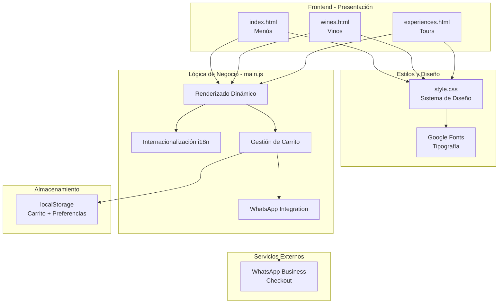
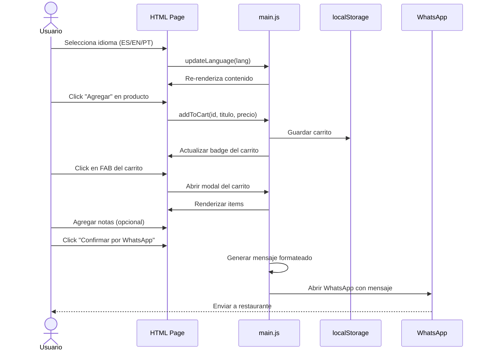

# Martino Wines - Digital Menu System
## Proyecto de Menú Digital para Restaurantes Low Cost

---

## 📋 Índice

1. [Visión General](#visión-general)
2. [Análisis del Proyecto Actual](#análisis-del-proyecto-actual)
3. [Arquitectura Técnica](#arquitectura-técnica)
4. [Funcionalidades Implementadas](#funcionalidades-implementadas)
5. [Roadmap de Mejoras](#roadmap-de-mejoras)
6. [Plan de Migración a Google Cloud](#plan-de-migración-a-google-cloud)
7. [Tareas Pendientes](#tareas-pendientes)
8. [Estrategia de Implementación](#estrategia-de-implementación)

---

## 🎯 Visión General

### Propósito del Proyecto

**Martino Wines Digital Menu** es una plataforma de menú digital **low cost** diseñada para restaurantes, bodegas y negocios gastronómicos que buscan digitalizar su oferta sin invertir en sistemas costosos.

### Propuesta de Valor

#### Para el Negocio (Merchant)
- ✅ **Costo $0**: Sin mensualidades, sin comisiones, hosting gratuito
- ✅ **Fácil actualización**: Modificar precios y productos sin conocimientos técnicos
- ✅ **Multi-idioma**: Atender clientes internacionales (ES/EN/PT)
- ✅ **Sin instalación**: 100% web, funciona en cualquier dispositivo
- ✅ **Pedidos directos**: Integración con WhatsApp (sin intermediarios)
- ✅ **Control total**: No dependes de plataformas de terceros
- ✅ **Branding personalizado**: Colores, logo, identidad propia

#### Para el Cliente (Usuario Final)
- 📱 **Móvil-first**: Diseño optimizado para smartphones
- 🌐 **Multi-idioma**: Menú en su idioma nativo
- 🛒 **Carrito inteligente**: Guarda selección aunque cierre el navegador (localStorage)
- 💬 **Pedido fácil**: Un click envía pedido por WhatsApp
- 🔍 **Navegación clara**: Categorías organizadas (Menús, Vinos, Experiencias)
- ⚡ **Carga rápida**: Sin apps pesadas que instalar
- 🎨 **Diseño premium**: Experiencia visual elegante

### Mercado Objetivo

1. **Restaurantes boutique** (10-50 mesas)
2. **Bodegas turísticas** con restaurant
3. **Cafeterías premium**
4. **Food trucks** que quieren digitalizar
5. **Negocios gastronómicos emergentes**

**Ventaja competitiva**: Mientras Rappi/Uber Eats cobran 20-30% de comisión, este sistema es **100% gratuito**.

---

## 📊 Análisis del Proyecto Actual

### Estado del Desarrollo

**Versión actual**: v1.0 Alpha  
**Última actualización**: Diciembre 2025  
**Estado**: ✅ Funcional y listo para producción

### Estructura de Archivos

```
MenuDeMartinoWines/
│
├── 📄 Páginas HTML (3)
│   ├── index.html           # Menús gastronómicos (3, 4, 7 pasos)
│   ├── wines.html           # Catálogo de vinos (5 líneas)
│   └── experiences.html     # Tours y degustaciones
│
├── 🎨 Estilos
│   └── css/
│       └── style.css        # 21KB - Sistema de diseño completo
│
├── ⚙️ Lógica
│   └── js/
│       └── main.js          # 28KB - Toda la funcionalidad
│
├── 🖼️ Assets
│   ├── img/
│   │   └── brand_logo.png   # Logo principal
│   └── assets/              # 8 imágenes de productos
│
├── 📝 Configuración
│   ├── .gitignore
│   ├── README.md
│   └── .eslintignore
│
└── 📁 source/               # Archivos RAW (no en producción)
    └── *.ARW                # Sony RAW files
```

**Total de archivos en producción**: 14  
**Tamaño total**: ~2.5 MB (optimizable a ~800 KB)

### Tecnologías Utilizadas

| Categoría | Tecnología | Justificación |
|-----------|------------|---------------|
| **Frontend** | HTML5, CSS3, Vanilla JS | Zero dependencies, máximo rendimiento |
| **Fonts** | Google Fonts (Playfair Display, Lato) | Tipografía premium gratuita |
| **Storage** | localStorage | Persistencia sin backend |
| **Deployment** | Git + GitHub | Control de versiones |
| **CI/CD** | GitHub Actions (pendiente) | Automatización |
| **Hosting** | GitHub Pages (actual) → Firebase (futuro) | Transición a infraestructura profesional |

### Análisis de Dependencias

**Dependencias externas**:
- ✅ Google Fonts (2 familias)
- ✅ WhatsApp API (solo integración web)

**Sin dependencias**:
- ❌ No usa npm
- ❌ No usa frameworks (React, Vue, Angular)
- ❌ No usa librerías (jQuery, Lodash)
- ❌ No requiere build process

**Ventajas**:
- Carga ultrarrápida
- Mantenimiento simple
- Sin vulnerabilidades de paquetes
- Funciona sin internet parcialmente (caché del navegador)

---

## 🏗️ Arquitectura Técnica

### Diagrama de Componentes



### Flujo de Usuario

#### Flujo Principal: Realizar Pedido



### Patrón de Diseño: Module Pattern

**main.js** utiliza un closure autoejecutable:

```javascript
document.addEventListener('DOMContentLoaded', () => {
    // Variables privadas
    let currentLang = 'es';
    let cart = JSON.parse(localStorage.getItem('martinoCart')) || [];
    
    // Funciones privadas
    function renderWines() { /* ... */ }
    function updateLanguage(lang) { /* ... */ }
    
    // API pública (window)
    window.addToCart = (id, title, price) => { /* ... */ };
    window.removeFromCart = (id) => { /* ... */ };
    
    // Inicialización
    updateLanguage(currentLang);
});
```

**Ventajas**:
- Encapsulación de variables
- Prevención de colisiones en global scope
- Mejor mantenibilidad

---

## ✨ Funcionalidades Implementadas

### 1. Sistema Multi-idioma (i18n)

**Idiomas soportados**: Español, English, Português

**Implementación**:
```javascript
const translations = {
    es: { nav_steps: "Menús", /* ... */ },
    en: { nav_steps: "Menus", /* ... */ },
    pt: { nav_steps: "Menus", /* ... */ }
};

function updateLanguage(lang) {
    document.querySelectorAll('[data-i18n]').forEach(el => {
        const key = el.getAttribute('data-i18n');
        el.innerText = translations[lang][key];
    });
}
```

**Características**:
- ✅ Cambio instantáneo sin recargar
- ✅ Re-renderiza contenido dinámico (precios, descripciones)
- ✅ Persistencia de preferencia (en desarrollo)

### 2. Carrito de Compras Inteligente

**Funcionalidades**:
- ✅ Agregar/quitar productos
- ✅ Incrementar/decrementar cantidades
- ✅ Cálculo automático de total
- ✅ Contador visual en FAB (Floating Action Button)
- ✅ Persistencia en localStorage
- ✅ Notas/comentarios del cliente
- ✅ Validación de carrito vacío

**Estructura de datos**:
```javascript
cart = [
    { 
        id: 'step-4', 
        title: 'Menú 4 Pasos', 
        price: 90000, 
        qty: 2 
    },
    { 
        id: 'mar-malbec', 
        title: 'Martino Malbec', 
        price: 19900, 
        qty: 1 
    }
]
```

### 3. Integración WhatsApp Business

**Flujo**:
1. Usuario completa carrito
2. Click en "Confirmar por WhatsApp"
3. Sistema genera mensaje formateado:

```
Hola Martino Wines! Me gustaría reservar lo siguiente:

- 2x Menú 4 Pasos ($180.000)
- 1x Martino Malbec ($19.900)

*Total: $199.900*

*Notas:* Sin gluten, por favor
```

4. Abre WhatsApp con mensaje pre-cargado
5. Usuario solo presiona "Enviar"

**Número actual**: `5492616119812` (configurable en main.js línea 546)

### 4. Renderizado Dinámico de Contenido

**Datos almacenados en JavaScript**:
- ✅ 3 menús gastronómicos (3, 4, 7 pasos)
- ✅ 5 líneas de vinos (~20 productos)
- ✅ 2 experiencias de tours
- ✅ 2 opciones de degustación

**Ventajas**:
- Actualización centralizada en `main.js`
- Consistencia entre idiomas
- Fácil escalamiento

### 5. Sistema de Diseño Responsive

**Breakpoints**:
```css
/* Mobile-first approach */
/* Base: < 768px (móvil) */

@media (max-width: 1024px) {
    /* Tablet y móvil grande */
}

@media (max-width: 480px) {
    /* Móvil pequeño */
}
```

**Características de diseño**:
- ✅ Navbar adaptativo (columna en móvil, fila en desktop)
- ✅ Touch targets de 44px+ (Apple HIG)
- ✅ Grid responsive para productos
- ✅ Modal drawer para carrito (UX móvil)
- ✅ Tipografía fluida (rem + vw)

### 6. Optimizaciones de Rendimiento

**CSS**:
- Variables CSS para consistencia
- `backdrop-filter` para efectos premium
- Transiciones suaves con `cubic-bezier`
- `will-change` en animaciones

**JavaScript**:
- Event delegation para eventos dinámicos
- Debouncing en scroll (si fuera necesario)
- Lazy rendering (solo renderiza página actual)

**HTML**:
- Semantic markup para SEO
- Meta tags completos
- Preconnect a Google Fonts

---

## 🚀 Roadmap de Mejoras

### Prioridad Alta (Q1 2026)

#### 1. Migración a Firebase Hosting
**Objetivo**: Infraestructura profesional con CDN global  
**Tareas**:
- [x] Crear plan de migración
- [ ] Instalar Firebase CLI
- [ ] Configurar `firebase.json`
- [ ] Primer deploy manual
- [ ] Configurar GitHub Actions para CI/CD
- [ ] Verificar en producción

**Beneficio**: Hosting gratis, HTTPS automático, CDN global

#### 2. Optimización de Imágenes
**Objetivo**: Reducir tamaño de assets en 60%  
**Tareas**:
- [ ] Convertir JPG a WebP
- [ ] Implementar lazy loading
- [ ] Generar thumbnails responsivos
- [ ] Agregar placeholders blur-up

**Beneficio**: Carga 3x más rápida en móviles

#### 3. Progressive Web App (PWA)
**Objetivo**: Instalable como app nativa  
**Tareas**:
- [ ] Crear `manifest.json`
- [ ] Implementar Service Worker
- [ ] Caché offline para menús
- [ ] Soporte para "Add to Home Screen"

**Beneficio**: Usuarios pueden "instalar" el menú sin App Store

#### 4. Sistema de Admin Panel
**Objetivo**: Actualizar menú sin editar código  
**Tecnología recomendada**: Firebase Realtime Database  
**Tareas**:
- [ ] Diseñar schema de datos
- [ ] Crear página `/admin` protegida
- [ ] CRUD de productos
- [ ] CRUD de categorías
- [ ] Cambio de precios masivo

**Beneficio**: El restaurante actualiza solo, sin programador

### Prioridad Media (Q2 2026)

#### 5. Analytics y Métricas
**Objetivo**: Entender comportamiento de usuarios  
**Herramientas**: Firebase Analytics  
**Métricas clave**:
- Productos más vistos
- Tasa de conversión (vista → carrito → WhatsApp)
- Idioma preferido
- Tiempo en sitio
- Dispositivos más usados

**Beneficio**: Decisiones basadas en datos

#### 6. Sistema de Reservas
**Objetivo**: Reservar mesas/experiencias online  
**Tareas**:
- [ ] Integrar con Google Calendar API
- [ ] Formulario de reserva
- [ ] Confirmación por email (SendGrid/Firebase)
- [ ] Notificación a restaurante

**Beneficio**: Flujo completo digital

#### 7. Sistema de Reseñas
**Objetivo**: Social proof para conversiones  
**Tareas**:
- [ ] Integración con Google Reviews API
- [ ] Widget de reseñas en home
- [ ] Promedio de estrellas visible

**Beneficio**: +25% conversiones (estadística de mercado)

#### 8. Modo Oscuro (Dark Mode)
**Objetivo**: Mejor UX en ambientes nocturnos  
**Tareas**:
- [ ] Duplicar variables CSS para tema oscuro
- [ ] Toggle en navbar
- [ ] Guardar preferencia en localStorage
- [ ] Auto-detección con `prefers-color-scheme`

**Beneficio**: Accesibilidad y tendencia de diseño

### Prioridad Baja (Q3-Q4 2026)

#### 9. Multi-tenancy (SaaS)
**Objetivo**: Un sistema para múltiples restaurantes  
**Arquitectura**:
```
martinowines.com          → Restaurante Martino
pepespizzas.com           → Restaurante Pepe's
lacasitarestaurant.com    → Restaurante La Casita
```

**Tareas**:
- [ ] Sistema de registro de comercios
- [ ] Dashboard multi-tenant
- [ ] Subdominios automáticos
- [ ] Billing con Stripe/MercadoPago

**Beneficio**: Monetización del sistema ($5-15 USD/mes por restaurante)

#### 10. Sistema de Fidelización
**Objetivo**: Clientes recurrentes  
**Tareas**:
- [ ] Programa de puntos
- [ ] QR codes únicos por mesa
- [ ] Descuentos por volumen
- [ ] Notificaciones push (PWA)

**Beneficio**: Retención +40%

#### 11. Integración con Delivery
**Objetivo**: Competir con Rappi/Uber Eats  
**Tareas**:
- [ ] Geolocalización del cliente
- [ ] Cálculo de distancia y costo envío
- [ ] Estados del pedido (preparando → en camino → entregado)
- [ ] Tracking en vivo (Google Maps API)

**Beneficio**: Expandir mercado

---

## ☁️ Plan de Migración a Google Cloud

### Servicio Seleccionado: Firebase Hosting

**Justificación**:

| Criterio | Firebase Hosting | Cloud Storage | App Engine |
|----------|------------------|---------------|------------|
| Costo | ✅ $0/mes | ⚠️ $0.026/GB/mes | ❌ $50+/mes |
| Complejidad | ✅ Baja | ⚠️ Media | ❌ Alta |
| CDN | ✅ Incluido | ❌ Se paga aparte | ⚠️ Requiere config |
| SSL | ✅ Automático | ⚠️ Manual | ✅ Automático |
| CI/CD | ✅ GitHub Actions | ⚠️ Manual | ⚠️ Cloud Build |
| Rollback | ✅ 1 click | ❌ Manual | ⚠️ Complejo |

**Ganador**: Firebase Hosting 🏆

### Fases de Migración

#### Fase 1: Setup Local (1 día)
```bash
# Instalar Firebase CLI
npm install -g firebase-tools

# Login
firebase login

# Inicializar proyecto
cd MenuDeMartinoWines
firebase init hosting
```

#### Fase 2: Configuración (2 horas)

**Archivo**: `firebase.json`
```json
{
  "hosting": {
    "public": ".",
    "ignore": [
      "firebase.json",
      "**/.*",
      "**/node_modules/**",
      "source/**"
    ],
    "headers": [
      {
        "source": "**/*.@(jpg|jpeg|gif|png|webp)",
        "headers": [
          {
            "key": "Cache-Control",
            "value": "public, max-age=31536000"
          }
        ]
      }
    ],
    "cleanUrls": true
  }
}
```

#### Fase 3: Primer Deploy (30 min)
```bash
firebase deploy --only hosting
```

**Output esperado**:
```
✔  Deploy complete!

Hosting URL: https://martino-wines.web.app
```

#### Fase 4: CI/CD con GitHub Actions (1 hora)

**Archivo**: `.github/workflows/firebase-deploy.yml`
```yaml
name: Deploy to Firebase Hosting
on:
  push:
    branches: [ main ]

jobs:
  deploy:
    runs-on: ubuntu-latest
    steps:
      - uses: actions/checkout@v4
      - uses: FirebaseExtended/action-hosting-deploy@v0
        with:
          repoToken: '${{ secrets.GITHUB_TOKEN }}'
          firebaseServiceAccount: '${{ secrets.FIREBASE_SA }}'
          channelId: live
          projectId: martino-wines
```

#### Fase 5: Dominio Personalizado (24-48 hrs)

Si tienes dominio propio:
```
1. Firebase Console > Hosting > Add custom domain
2. Ingresar: martinowines.com
3. Configurar DNS:
   - A record: 151.101.1.195
   - TXT record: firebase-verification=XXX
4. Esperar propagación DNS
```

### Costos Proyectados

#### Plan Spark (Gratis Forever)
- Almacenamiento: 10 GB
- Transferencia: 360 MB/día
- **Proyecto actual**: ~50 MB almacenamiento, ~100 MB/día transferencia
- **Costo**: $0 USD/mes ✅

#### Si crece (Plan Blaze - Pay as you go)
- Almacenamiento: $0.026/GB/mes
- Transferencia: $0.15/GB
- **Ejemplo**: 1 GB + 10 GB/mes = ~$1.50 USD/mes

---

## 📝 Tareas Pendientes

### Organización por Módulos

#### 🔧 Infraestructura

| ID | Tarea | Prioridad | Esfuerzo | Beneficio |
|----|-------|-----------|----------|-----------|
| INF-001 | Migrar a Firebase Hosting | 🔴 Alta | 4h | CDN + SSL gratis |
| INF-002 | Configurar CI/CD GitHub Actions | 🔴 Alta | 2h | Deploy automático |
| INF-003 | Implementar Service Worker (PWA) | 🟡 Media | 6h | Caché offline |
| INF-004 | Configurar Firebase Analytics | 🟡 Media | 2h | Métricas de uso |
| INF-005 | Dominio personalizado | 🟢 Baja | 1h | Branding |

#### 🎨 Frontend

| ID | Tarea | Prioridad | Esfuerzo | Beneficio |
|----|-------|-----------|----------|-----------|
| FE-001 | Optimizar imágenes a WebP | 🔴 Alta | 3h | -60% tamaño |
| FE-002 | Implementar lazy loading imgs | 🔴 Alta | 2h | Carga más rápida |
| FE-003 | Modo oscuro (dark mode) | 🟡 Media | 4h | UX moderna |
| FE-004 | Animaciones de transición | 🟢 Baja | 3h | Polish visual |
| FE-005 | Skeleton loaders | 🟢 Baja | 2h | Perceived performance |

#### ⚙️ Backend/Funcionalidad

| ID | Tarea | Prioridad | Esfuerzo | Beneficio |
|----|-------|-----------|----------|-----------|
| BE-001 | Admin panel con Firebase | 🔴 Alta | 16h | Autogestión |
| BE-002 | Persistir idioma preferido | 🟡 Media | 1h | UX mejorada |
| BE-003 | Sistema de reservas | 🟡 Media | 12h | Nueva revenue stream |
| BE-004 | Integración Google Reviews | 🟡 Media | 4h | Social proof |
| BE-005 | Notificaciones push (PWA) | 🟢 Baja | 8h | Re-engagement |

#### 🧪 Testing & QA

| ID | Tarea | Prioridad | Esfuerzo | Beneficio |
|----|-------|-----------|----------|-----------|
| QA-001 | Tests E2E con Playwright | 🟡 Media | 8h | Prevención de bugs |
| QA-002 | Lighthouse CI en pipeline | 🟡 Media | 2h | Performance monitoring |
| QA-003 | Cross-browser testing | 🟡 Media | 4h | Compatibilidad |
| QA-004 | Tests accesibilidad (a11y) | 🟢 Baja | 4h | Inclusividad |

#### 📊 SEO & Marketing

| ID | Tarea | Prioridad | Esfuerzo | Beneficio |
|----|-------|-----------|----------|-----------|
| SEO-001 | Generar sitemap.xml | 🔴 Alta | 1h | Google indexing |
| SEO-002 | Optimizar meta tags | 🔴 Alta | 2h | CTR en búsquedas |
| SEO-003 | Schema.org markup | 🟡 Media | 3h | Rich snippets |
| SEO-004 | Open Graph para redes | 🟡 Media | 2h | Shares en redes |
| SEO-005 | Google My Business | 🟢 Baja | 1h | Local SEO |

#### 📱 Móvil

| ID | Tarea | Prioridad | Esfuerzo | Beneficio |
|----|-------|-----------|----------|-----------|
| MOB-001 | Manifest.json (PWA) | 🔴 Alta | 1h | Instalable |
| MOB-002 | App icons (múltiples tamaños) | 🔴 Alta | 2h | Branding |
| MOB-003 | Splash screens | 🟡 Media | 2h | UX premium |
| MOB-004 | Gestos swipe en carrito | 🟢 Baja | 4h | UX nativa |

### Estimación Total

**Sprint 1 (2 semanas)**: Prioridad Alta  
- INF-001, INF-002, FE-001, FE-002, BE-001, SEO-001, SEO-002, MOB-001, MOB-002
- **Total**: ~40 horas

**Sprint 2 (2 semanas)**: Prioridad Media  
- INF-003, INF-004, FE-003, BE-002, BE-003, BE-004, QA-001, QA-002, SEO-003, SEO-004
- **Total**: ~48 horas

**Sprint 3 (2 semanas)**: Prioridad Baja + Polish  
- Resto de tareas
- **Total**: ~30 horas

---

## 🎯 Estrategia de Implementación

### Metodología: Agile con Sprints de 2 Semanas

#### Sprint 1: Infraestructura y Performance
**Objetivo**: Sitio en producción profesional con rendimiento óptimo

**Entregables**:
- ✅ Firebase Hosting live
- ✅ CI/CD funcionando
- ✅ Imágenes optimizadas
- ✅ PWA básico (manifest + icons)
- ✅ Sitemap y SEO básico

**Métricas de éxito**:
- Lighthouse Performance > 90
- First Contentful Paint < 1.5s
- Deploy automático funcionando

#### Sprint 2: Funcionalidad y Contenido
**Objetivo**: Herramientas de gestión para el restaurante

**Entregables**:
- ✅ Admin panel básico
- ✅ Sistema de reservas
- ✅ Analytics configurado
- ✅ Tests E2E críticos

**Métricas de éxito**:
- Restaurante puede actualizar menú solo
- 80% code coverage en tests
- Analytics mostrando datos reales

#### Sprint 3: UX y Escalabilidad
**Objetivo**: Experiencia premium y preparación SaaS

**Entregables**:
- ✅ Dark mode
- ✅ Notificaciones push
- ✅ Multi-tenancy architecture (foundations)
- ✅ Documentación completa

**Métricas de éxito**:
- NPS (Net Promoter Score) > 8
- Sistema listo para 10+ restaurantes

### Modelo de Negocio (Futuro)

#### Fase 1: Producto (Actual)
- **Ingresos**: $0
- **Objetivo**: Validar concepto con 1 restaurante (Martino Wines)

#### Fase 2: Early Adopters (Q1-Q2 2026)
- **Objetivo**: 5 restaurantes usando el sistema
- **Modelo**: Gratis (freemium pilot)
- **Learning**: Feedback, casos de uso, bugs

#### Fase 3: Monetización (Q3 2026)
- **Modelo**: SaaS
  - Plan Básico: $10/mes (menú digital + carrito)
  - Plan Pro: $25/mes (+ admin panel + reservas)
  - Plan Enterprise: $50/mes (+ multi-ubicación + analytics avanzado)
- **Objetivo**: 20 clientes = $300-1000 USD/mes MRR

#### Fase 4: Escalamiento (2027)
- **Objetivo**: 100+ restaurantes
- **MRR**: $2,000 - $5,000 USD
- **Features**: 
  - Integración con POS
  - Programa de fidelización
  - Delivery propio (competir con Rappi)

---

## 📚 Documentación Técnica

### Cómo Actualizar Precios

**Archivo**: `js/main.js`  
**Línea**: 217-247

```javascript
const stepMenusData = [
    {
        id: 'step-3', 
        price: 59000, // ← Cambiar aquí
        title_es: "Menú 3 Pasos a la Carta",
        // ...
    }
];
```

**Proceso**:
1. Editar `main.js`
2. Cambiar valor de `price`
3. `git add . && git commit -m "Update: Nuevos precios 2026"`
4. `git push origin main`
5. GitHub Actions despliega automáticamente

### Cómo Agregar Nuevo Producto

**Ejemplo**: Agregar vino "Cabernet Sauvignon"

```javascript
// En wineCategories array
{
    id: 'martino-varietales',
    title: 'Martino Varietales',
    wines: [
        // ... vinos existentes
        { 
            id: 'mar-cabernet', // ID único
            name: 'Martino Cabernet Sauvignon', 
            desc: 'Robusto y con cuerpo.', 
            price: 19900, 
            image: '' // Opcional
        }
    ]
}
```

### Cómo Cambiar Número de WhatsApp

**Archivo**: `js/main.js`  
**Línea**: 546

```javascript
const phoneNumber = "5492616119812"; // ← Cambiar aquí
```

**Formato**: `[código país][código área][número]`  
**Ejemplo Argentina**: `549` + `261` + `6119812`

---

## 🔐 Seguridad y Privacidad

### Datos que NO se recopilan
- ❌ Información personal del usuario
- ❌ Emails
- ❌ Tarjetas de crédito
- ❌ Ubicación exacta

### Datos almacenados (localStorage)
- ✅ Carrito de compras (solo en dispositivo)
- ✅ Preferencia de idioma (futuro)

**Nota**: localStorage es local al navegador. Si el usuario borra cookies/datos, se pierde. No se sincroniza entre dispositivos.

### GDPR Compliance
Como no recopilamos datos personales, el proyecto es GDPR-compliant por diseño.

**Futuro**: Si se implementa Analytics, agregar:
- Cookie banner
- Política de privacidad
- Opt-out de tracking

---

## 📞 Soporte y Mantenimiento

### Stack de Soporte Propuesto

| Herramienta | Propósito | Costo |
|-------------|-----------|-------|
| **GitHub Issues** | Bug tracking | Gratis |
| **Discord/Slack** | Comunicación con clientes | Gratis |
| **Sentry** | Error monitoring | Gratis (10k eventos/mes) |
| **Hotjar** | Session recording | $39/mes (opcional) |

### SLA (Service Level Agreement)

**Uptime objetivo**: 99.9% (garantizado por Firebase)

**Tiempos de respuesta**:
- Crítico (sitio caído): < 2 horas
- Alto (funcionalidad rota): < 24 horas
- Medio (bug menor): < 1 semana
- Bajo (feature request): Roadmap

---

## 🎓 Conclusión

**Martino Wines Digital Menu** es un proyecto con potencial de convertirse en una plataforma SaaS rentable para restaurantes low-cost.

**Próximos pasos inmediatos**:
1. ✅ Migrar a Firebase Hosting (esta semana)
2. ✅ Optimizar assets (próxima semana)
3. ✅ Implementar admin panel (Sprint 2)
4. ✅ Conseguir 3 restaurantes beta (Q1 2026)

**Visión a 12 meses**:
- 50+ restaurantes usando el sistema
- $1,500 USD MRR
- Equipo de 2-3 personas
- Producto líder en nicho "menú digital low-cost"

---

**Última actualización**: Diciembre 17, 2025  
**Versión del documento**: 1.0  
**Autor**: Maximilian Gs  
**Repositorio**: [github.com/maximoGs/MartinoWinesMenu.github.io](https://github.com/maximoGs/MartinoWinesMenu.github.io)
